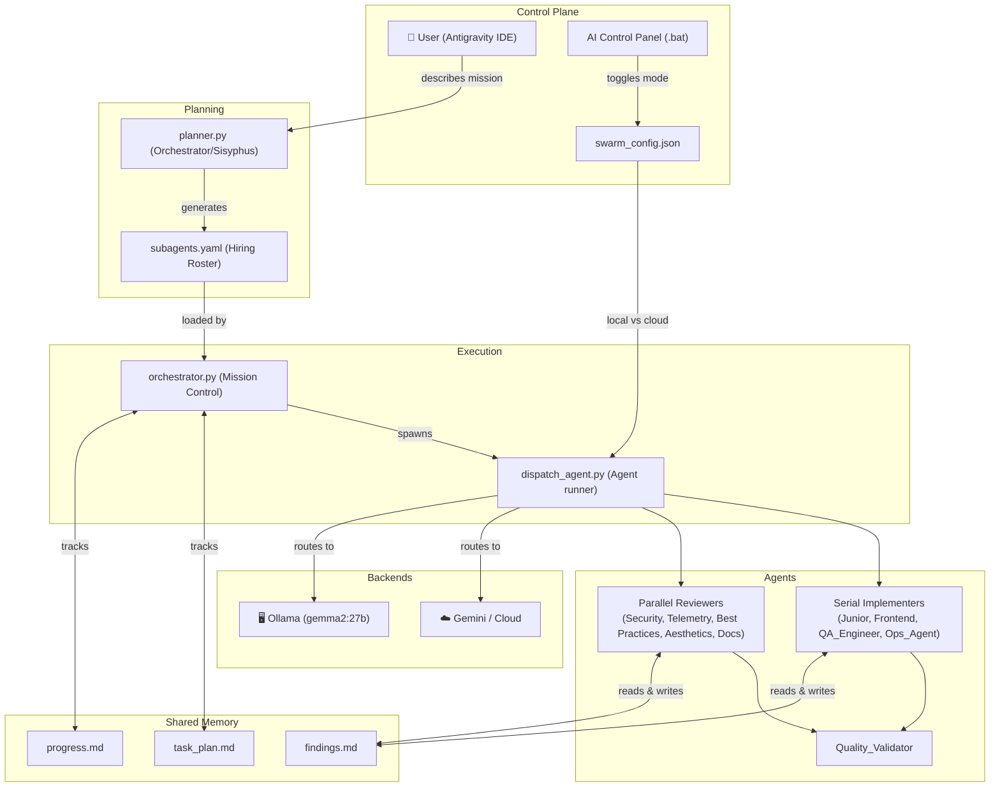

# Antigravity Swarm: Architecture Document

**Version:** 1.1.0
**Date:** 2026-02-21

## System Overview

The Antigravity Swarm is a multi-agent orchestration framework built on top of the Antigravity IDE and Ollama local LLMs. It enables autonomous teams of specialized sub-agents to collaboratively plan, implement, review, and ship software.



## Component Descriptions

### `swarm_config.json`
The single configuration toggle for mode and model.
```json
{
  "mode": "local",
  "ollama_url": "http://localhost:11434",
  "ollama_model": "gemma2:27b"
}
```

### `planner.py`
The Orchestrator. Receives a mission string, calls the active LLM backend to generate an agent hiring plan, and writes:
- `subagents.yaml` — the roster of selected agents and their modes
- `task_plan.md` / `findings.md` / `progress.md` — Manus Protocol shared memory

### `orchestrator.py`
The Mission Controller. Loads `subagents.yaml` and executes agents in three phases:
1. **Parallel** — all Reviewer agents fire simultaneously
2. **Serial** — Implementers execute one-at-a-time in order
3. **Validator** — final gatekeeper runs after all previous phases complete

### `dispatch_agent.py`
The per-agent runner. Reads `swarm_config.json` to route a task to Gemini CLI or Ollama, streams the LLM response, and parses embedded `<<WRITE_FILE>>` / `<<RUN_COMMAND>>` shims.

### `ollama_client.py`
A lightweight Python Ollama API wrapper that provides `chat()`, `generate()`, and `check_connection()` functions, routing all traffic to `http://localhost:11434`.

---

## Execution & Concurrency Model

| Agent Class | Mode | Reason |
|---|---|---|
| Implementers (Junior, Frontend, QA_Engineer, Ops_Agent) | `serial` | Write files; sequential prevents merge conflicts |
| Reviewers (Security, Telemetry, Best Practices, etc.) | `parallel` | Read-only analysis; can run concurrently |
| Quality_Validator | `validator` | Must run last; verifies all work |

---

## Loop Safety & Human Intervention

### Automatic Retry
Failed agents are automatically retried up to `MAX_RETRIES` times (default: 2) before escalating to a human.

### Human Intervention Prompt
After `MAX_RETRIES` exhausted, the live TUI pauses and prompts:
- **[r]** Retry once more
- **[s]** Skip this agent and continue the mission
- **[a]** Abort the entire mission

### Sentinel File Break (At Any Time)
Create a file named `HUMAN_BREAK` in the working directory while the Orchestrator is running. On the next UI tick (every 100ms), the dashboard will pause and offer a **Resume / Abort** choice.

```powershell
# To trigger a human break at any time:
New-Item -Path ".\HUMAN_BREAK" -ItemType File
```

---

## Hybrid Local / Cloud Routing

| Scenario | Recommended Mode | Why |
|---|---|---|
| Architecture planning, deep reasoning | Cloud (Gemini) | Larger context, stronger reasoning |
| Bulk code generation, file writing | Local (gemma2:27b) | Zero token cost, private, fast |
| Review/analysis passes | Either | Reviewers are lightweight enough for local |

Use the **AI Control Panel** batch file to toggle mode between missions.

---

## Shared Memory (Manus Protocol)

All agents read and write to three files in the project root:

| File | Purpose |
|---|---|
| `task_plan.md` | Source of truth: mission checklist |
| `findings.md` | Shared scratchpad: research, decisions, notes |
| `progress.md` | Execution log: completed steps |
